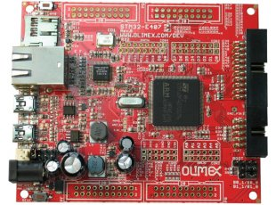

# Olimex LTD STM32-E407 (reference development board)

The Olimex LTD STM-E407 is an open hardware low-cost entry board for developing custom applications
with the STM32F407ZGT6 Cortex M4 microcontrollers from STMicroelectronics. This board
has plenty of resources and all GPIO ports are available on extension connectors.

### Relevant information about the board
- [Board official web page](https://www.olimex.com/Products/ARM/ST/STM32-E407/)
- [Schematics](../../schematics/stm32-e407/)
- [Design files](../../design_files/stm32-e407/)
- [User manual](./STM32-E407.pdf)
- [What do you need to program and use it?](https://github.com/microROS/NuttX/issues/16)

### Tutorials and additional material
- [Set up the development environment](https://github.com/microROS/docker/tree/master/stm32-e407)
- [Pin configuration](https://github.com/microROS/NuttX/issues/6)
- [Registering a NuttX driver](https://github.com/microROS/NuttX/issues/3)
- [Developing a custom driver for NuttX](https://github.com/microROS/NuttX/issues/9)
- [Using Serial Communication in you app](https://github.com/microROS/NuttX/issues/10)
- [How to use I2C in NuttX](https://github.com/microROS/NuttX/issues/11)
- [Developing a NuttX application (app)](https://github.com/microROS/NuttX/issues/12)
- [How to use on board Ethernet in NuttX](https://github.com/microROS/NuttX/issues/13)
- [How to active/port new features to your board](https://github.com/microROS/NuttX/issues/14)
- [How to use an UDP Server/Client over 6LowPan in NuttX](https://github.com/microROS/NuttX/issues/23)
- [How to use the ADC in NuttX](https://github.com/microROS/NuttX/issues/24)
- [How to use the SD card reader to read/write files](https://github.com/microROS/NuttX/issues/25)
- [How to add an external library](https://github.com/microROS/NuttX/issues/28)
- [How to use SPI in NuttX](https://github.com/microROS/NuttX/issues/29)
