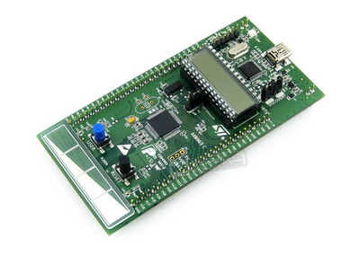

## STM32L1 Discovery Kit

The STM32L1 Discovery Kit is an open hardware ultra low power and low-cost entry board for developing custom applications
with the STM32L152RCT6 Cortex M3 microcontrollers from STMicroelectronics. This board
has plenty of resources and all GPIO ports are available on extension connectors.

### Relevant information about the board
- [Board official web page](http://www.st.com/en/evaluation-tools/32l152cdiscovery.html#quickview-scroll)
- [Schematics](../../schematics/stm32l1discovery/)
- [Design files](../../design_files/stm32l1discovery/)
- [User manual](./STM32L1DISCOVERY.pdf)

### Tutorials and additional material
- [Set up the development environment](https://github.com/microROS/docker/tree/master/stm32l1discovery)
- [Pin configuration](https://github.com/microROS/NuttX/issues/7)
- [Registering a NuttX driver](https://github.com/microROS/NuttX/issues/3)
- [Developing a custom driver for NuttX](https://github.com/microROS/NuttX/issues/9)
- [Using Serial Communication in you app](https://github.com/microROS/NuttX/issues/10)
- [How to use I2C in NuttX](https://github.com/microROS/NuttX/issues/11)
- [Developing a NuttX application (app)](#) (WIP)
- [Using (e.g. Ethernet) communication interface](#) (WIP)
