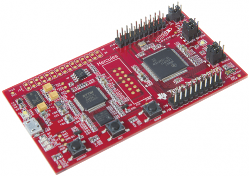

## Hercules LaunchXL-TMS57004

The Hercules LaunchPad LaunchXL-TMS57004 is an low-cost development kit for developing custom safety applications with the TMS570LS0432 Cortex R4 micro-controllers from Texas Instruments.
This board is focus in safety functionality being base on  IEC 61508 SIL 3 and ISO 26262 ASIL D certified also have a plenty of resources such as GPIO,ADC, Ambient light sensor, led...

### Relevant information about the board
- [Board official web page](http://www.ti.com/tool/LAUNCHXL-TMS57004)
- [Schematics](../../schematics/tms57004/)
- [Design files](../../design_files/tms57004/)
- [User manual](./tms57004.pdf)
- [What do you need to program and use it?](https://github.com/microROS/NuttX/issues/16)

### Tutorials and additional material
- [Set up the development environment](https://github.com/microROS/docker/tree/master/tms57004)
- [Pin configuration](https://github.com/microROS/NuttX/issues/8)
- [Registering a NuttX driver](https://github.com/microROS/NuttX/issues/3)
- [Developing a custom driver for NuttX](https://github.com/microROS/NuttX/issues/9)
- [Using Serial Communication in you app](https://github.com/microROS/NuttX/issues/10)
- [How to use I2C in NuttX](https://github.com/microROS/NuttX/issues/11)
- [Developing a NuttX application (app)](https://github.com/microROS/NuttX/issues/12)
- [How to active/port new features to your board](https://github.com/microROS/NuttX/issues/14)
